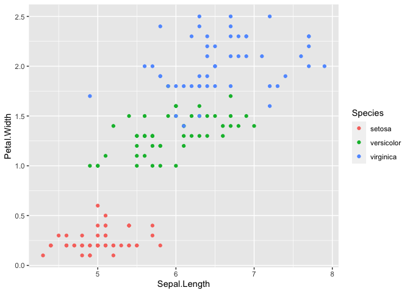
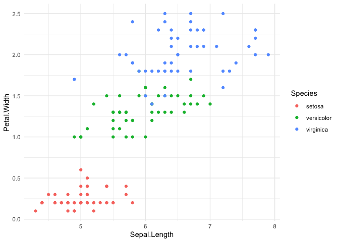
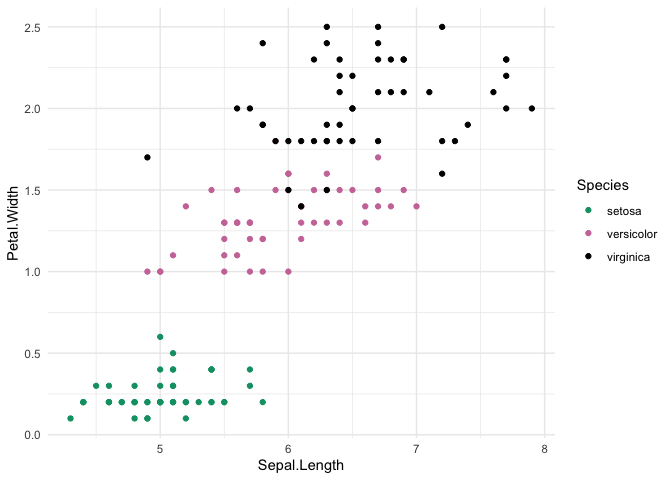
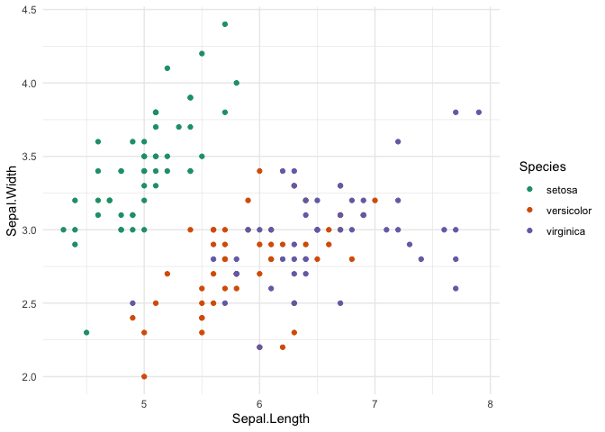
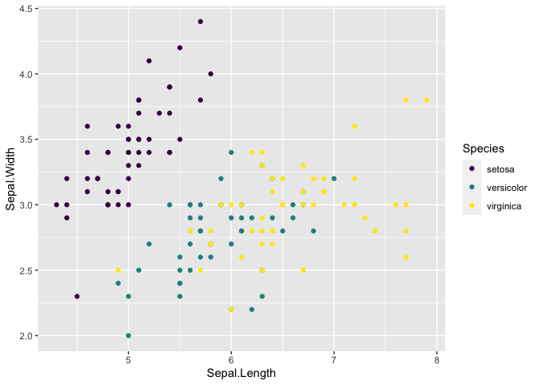

Color Deficiency in Data Visualization
================
Margaret Reed, Yaxin Hu
2022-11-15

## Color Vision Deficiency and Data Visualization

Color vision deficiency is typically referred to as color blindness and
can be defined as the inability to distinguish certain colors, or any
colors at all. Research shows that about 8% of men and 0,5% of women
suffer from color blindness deficiency to some extent.

As mentioned in class, color vision deficiency is an important issue to
be aware of when creating data visualizations. While red-green confusion
is the most well known there are several types, all of which should be
considered when creating accessible visualizations.

Problems faced by color blind people when it comes to data
visualization:

\*Not being able to recognize series or categories: The biggest problem
occurs when people suffering from CVD has to distinguish between
categories. Certain colors that look totally different for healthy
people may look almost identical for color blind people.

\*Not being able to recognize the key message at a glance: Another
problem might occur is that color blind people may not be able to
recognize key message at a glance. For example you might color code your
graph in the way that the increase is colored in green and decrease is
colored in red. But color blind people wouldn’t notice that.

So it is important to design color vision deficiency friendly graph when
doing visualization.

### Types of color vision deficiencies:

#### Red-green color blindness

The most common type of color blindness makes it hard to tell the
difference between red and green.

There are 4 types of red-green color blindness:

**Deuteranomaly** is the most common type of red-green color blindness.
It makes green look more red. This type is mild and doesn’t usually get
in the way of normal activities.

**Protanomaly**- makes red look more green and less bright. This type is
mild and usually doesn’t get in the way of normal activities.

**Protanopia** and **deuteranopia** both make you unable to tell the
difference between red and green at all.

#### Blue-yellow color blindness

This less-common type of color blindness makes it hard to tell the
difference between blue and green, and between yellow and red.

There are 2 types of blue-yellow color blindness:

**Tritanomaly**- makes it hard to tell the difference between blue and
green, and between yellow and red.

**Tritanopia**- makes you unable to tell the difference between blue and
green, purple and red, and yellow and pink. It also makes colors look
less bright.

#### Complete color blindness

If you have complete color blindness, you can’t see colors at all. This
is also called **monochromacy**, and it’s quite uncommon. Depending on
the type, you may also have trouble seeing clearly and you may be more
sensitive to light.

Source:
<https://www.nei.nih.gov/learn-about-eye-health/eye-conditions-and-diseases/color-blindness/types-color-blindness>

### Test your plots

While not an exact science, there are some great tools to test how your
visualizations may look to someone with these conditions. The one I like
the most is Sim Daltonism. ([Download
here](https://apps.apple.com/us/app/sim-daltonism/id693112260?mt=12))

However, this application only works on Macs so if you have a windows or
linux machine, I would recommend the program that was suggested in
class.

Here is an example of what the standard ggplot color palette looks like
with different color vision deficiencies.

#### Original:

``` r
iris %>%
  ggplot(
    aes(x = Sepal.Length, y = Petal.Width, color = Species)
  ) +
  geom_point()
```

<!-- -->

Here is how this might plot look like with the above conditions:


**Ways to improve without changing color:**

Increase Contrast:

``` r
iris %>%
  ggplot(
    aes(x = Sepal.Length, y = Petal.Width, color = Species)
  ) +
  geom_point() +
  theme_minimal()
```

<!-- -->

Double Encoding:

``` r
iris %>%
  ggplot(
    aes(x = Sepal.Length, y = Petal.Width, color = Species, shape = Species)
  ) +
  geom_point() +
  theme_minimal()
```

<!-- -->

**A Better Palette:**

I really like the Okabe-Ito pallete designed by Masataka Okabe and Kei
Ito

(learn more read [here](https://jfly.uni-koeln.de/color/): )

Here is a [good visual
guide](https://mikemol.github.io/technique/colorblind/2018/02/11/color-safe-palette.html).

To easily use this palette in R, I like the `ggokabeito` package, which
can be downloaded from CRAN.

Example with new color palette:

``` r
iris %>%
  ggplot(
    aes(x = Sepal.Length, y = Petal.Width, color = Species)
  ) +
  geom_point() +
  scale_color_okabe_ito(order = c(3,7,9)) +
  theme_minimal()
```

<!-- -->


**Other packages to deal with color blind:**

1.Another nice package–“RColorBrewer” can also deal with colorblind
<https://colorbrewer2.org/#type=sequential&scheme=BuGn&n=3>

``` r
library(RColorBrewer)
```

This function is to see the list of all the palettes.

Maxcolors represent the maximum number of colors available in the
palette.

Category represents what kind of data it can apply to, there are 3 kinds
of palattes: Sequential palattes, Qualitative palettes and Diverging
palattes. Sequential palettes: suited to ordered data that progress from
low to high. Lightness steps dominate the look of these schemes, with
light colors for low data values to dark colors for high data values.
Qualitative palettes:do not imply magnitude differences between legend
classes, and hues are used to create the primary visual differences
between classes. Qualitative schemes are best suited to representing
nominal or categorical data. Diverging palettes:put equal emphasis on
mid-range critical values and extremes at both ends of the data range.
The critical class or break in the middle of the legend is emphasized
with light colors and low and high extremes are emphasized with dark
colors that have contrasting hues.

Colorblind represents color blind friendly or not.(True:colorblind
friendly; False: not friendly to colorblind)

``` r
brewer.pal.info
```

    ##          maxcolors category colorblind
    ## BrBG            11      div       TRUE
    ## PiYG            11      div       TRUE
    ## PRGn            11      div       TRUE
    ## PuOr            11      div       TRUE
    ## RdBu            11      div       TRUE
    ## RdGy            11      div      FALSE
    ## RdYlBu          11      div       TRUE
    ## RdYlGn          11      div      FALSE
    ## Spectral        11      div      FALSE
    ## Accent           8     qual      FALSE
    ## Dark2            8     qual       TRUE
    ## Paired          12     qual       TRUE
    ## Pastel1          9     qual      FALSE
    ## Pastel2          8     qual      FALSE
    ## Set1             9     qual      FALSE
    ## Set2             8     qual       TRUE
    ## Set3            12     qual      FALSE
    ## Blues            9      seq       TRUE
    ## BuGn             9      seq       TRUE
    ## BuPu             9      seq       TRUE
    ## GnBu             9      seq       TRUE
    ## Greens           9      seq       TRUE
    ## Greys            9      seq       TRUE
    ## Oranges          9      seq       TRUE
    ## OrRd             9      seq       TRUE
    ## PuBu             9      seq       TRUE
    ## PuBuGn           9      seq       TRUE
    ## PuRd             9      seq       TRUE
    ## Purples          9      seq       TRUE
    ## RdPu             9      seq       TRUE
    ## Reds             9      seq       TRUE
    ## YlGn             9      seq       TRUE
    ## YlGnBu           9      seq       TRUE
    ## YlOrBr           9      seq       TRUE
    ## YlOrRd           9      seq       TRUE

This function is to show specific colors for each palette.

``` r
#display.brewer.all(n=NULL, type="all", select=NULL, exact.n=TRUE)
display.brewer.all(colorblindFriendly = TRUE)
```

<!-- -->

Example with a colorblind friendly color palette(“Dark2”):

``` r
library(RColorBrewer)

iris %>%
  ggplot(aes(Sepal.Length, Sepal.Width)) + 
  geom_point(aes(color = Species)) +
  theme_minimal()+
  scale_color_brewer(palette = "Dark2")
```

<!-- -->

2.Another nice package–“viridis”:aims to draw images that are easier to
read by color blind and/or color deficient people.

<https://cran.r-project.org/web/packages/viridis/index.html>

Discrete variables can use scale_color_viridis(); Continuous variables
can use scale_fill_viridis()

Example using scale_color_viridis():

``` r
library(viridis)
```

    ## Loading required package: viridisLite

``` r
iris %>%
  ggplot(aes(Sepal.Length, Sepal.Width))+
  geom_point(aes(color = Species))+
  scale_color_viridis(discrete = TRUE)
```

<!-- -->

### Other considerations

While it is very important to make sure that data science and
visualizations are accessible to as many people as possible, these
considerations for color extend further than those with color vision
deficiencies. Often times the medium in which we present our
visualizations can considerably impact how the color distinctions come
across. Not every visualization is viewed on a large projector, some are
dispersed for individual viewing, while others may even be printed in
black and white. Therefore is it very important to consider other skills
such as double encoding, using shapes and textures, using high contrast
colors when creating visualizations.
